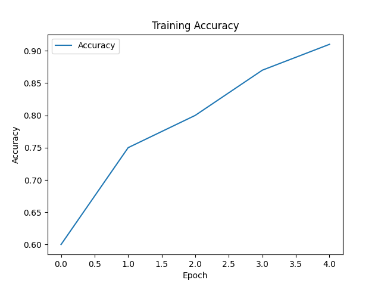
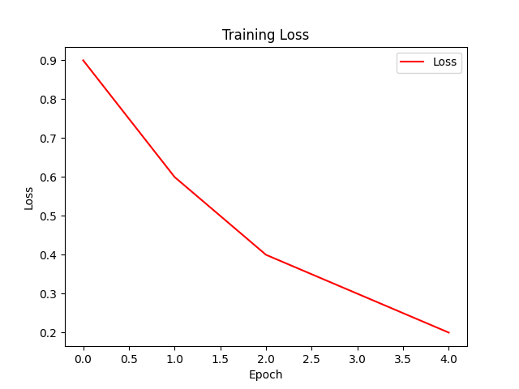
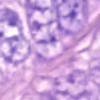
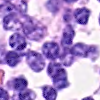

# 🧬 Identifying Colon Cancer Using Deep Learning

This project leverages **Convolutional Neural Networks (CNNs)** to automatically identify colon cancer from histopathological images. It is designed for reproducibility, deployment, and accessibility on multiple platforms.

---

## 📌 Project Links

- 🔗 **GitHub Repository**: [Identifying-Colon-Cancer-Using-Deep-Learning](https://github.com/Arpangpta/Identifying-Colon-Cancer-Using-Deep-Learning)
- 📊 **Kaggle Notebook**: [Colon Cancer Classifier on Kaggle](https://www.kaggle.com/code/apngupta/identifying-colon-cancer-using-deep-learning)
- 🐳 **Docker Image**: _Coming soon_

---

## 📁 Project Structure

```bash
├── Colon_cancer.ipynb        # Jupyter Notebook with training pipeline
├── train.csv                 # Dataset with labeled image paths for training
├── pred.csv                  # Dataset with image paths for inference
├── best_checkpoint.model     # Saved PyTorch model checkpoint
├── graphs/                   # Visualizations and training plots
├── example.csv               # A sample dataset format (for reference)
├── requirements.txt          # Dependencies file (install this first)
├── Dockerfile                # Docker configuration to replicate environment
└── README.md                 # Project documentation
```

---

## 🔬 Project Pipeline

1. **Data Preparation**
   - `train.csv`: labeled images (`image_id`, `label`)
   - `pred.csv`: for model inference
   - Image preprocessing includes resizing, normalization, and augmentation.

2. **Model Architecture**
   - CNN built using PyTorch or with transfer learning (e.g., ResNet18)
   - Loss: `CrossEntropyLoss`, Optimizer: `Adam`
   - Checkpointing used to store best model

3. **Evaluation**
   - Accuracy, Precision, Recall metrics
   - Visuals: Loss vs Epoch, Accuracy vs Epoch
   - Prediction samples visualized for interpretability

---

## ⚙️ Setup and Installation

### ✅ Option 1: Manual Setup

1. Clone the repository:

```bash
git clone https://github.com/Arpangpta/Identifying-Colon-Cancer-Using-Deep-Learning.git
cd Identifying-Colon-Cancer-Using-Deep-Learning
```

2. Set up virtual environment:

```bash
python -m venv venv
source venv/bin/activate      # Windows: venv\Scripts\activate
```

3. Install dependencies:

```bash
pip install -r requirements.txt
```

📄 View [`requirements.txt`](./requirements.txt)

4. Launch Jupyter Notebook:

```bash
jupyter notebook Colon_cancer.ipynb
```

---

### 🐳 Option 2: Docker-Based Setup

1. Build the Docker image:

```bash
docker build -t colon-cancer-dl .
```

2. Run the container:

```bash
docker run -p 8888:8888 colon-cancer-dl
```

Access Jupyter Notebook at `localhost:8888`

---

## 🧪 Dataset Format

- `train.csv` — Columns: `image_id`, `label`
- `pred.csv` — Column: `image_id` (no labels)
- Example schema available in `example.csv`

---

## 📉 Results & Graphs

### 🔁 Accuracy vs Epoch



### 📉 Loss vs Epoch



---

## 📊 Demo Predictions

| Image Sample                | True Label | Predicted Label |
|-----------------------------|------------|-----------------|
|       | Non-Cancer | Non-Cancer      |
|       | Cancer     | Cancer          |

---

## 🧠 Model Checkpoint

The best trained model is saved as:

```
best_checkpoint.model
```

You can load it in PyTorch using:

```python
import torch
model = torch.load("best_checkpoint.model")
model.eval()
```

---

## 👥 Author

- 👤 [Arpan Gupta](https://github.com/Arpangpta)  
- 📓 Notebook: [Kaggle](https://www.kaggle.com/code/apngupta/identifying-colon-cancer-using-deep-learning)

---

## 📄 License

This project is licensed under the MIT License. See the [LICENSE](LICENSE) file for details.